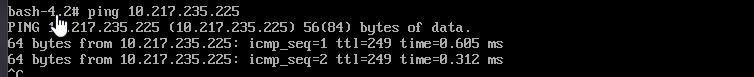

# Sysprep Linux RHEL


## Sysprep overview for RHEL 7/8

> Full procedure is below

1. Ensure system is fully patched.

2. Remove old Kernels

3. Clean out yum

4. Stop logging services.

5. Force the logs to rotate & remove old logs we don’t need.

6. Truncate the audit logs (and other logs we want to keep placeholders for)

7. Remove the udev persistent device rules.

8. Remove the traces of the template MAC address and UUIDs.

9. Clean /tmp

10. Remove host SSH Keys

11. Remove the root users history and other unnecessary stuff

12. Clean the svc_ansible home folder

13. PowerOff  

    > ***Note that if you power on again after this step, start at Step 1 again….*** 


## Sysprep Procedure for RHEL 7/8

1. Copy the script to the machine being prepped as a golden image.
   1. The script is called `sysprep.sh` and would have been provided with this document. 
   1. Move the `sysrep.sh` from the folder copied to  ‘/’
   1. Make executable and root owner

2. Perform a final full yum update

3. Remove old Kernels

   1. For RHEL7 

      ``` 
      package-cleanup --oldkernels --count=3
      ```

     2.   For RHEL8 

          ```
          yum remove --oldinstallonly --setopt installonly_limit=3 kernel
          
          ```

4. Clean out yum

   ``` shell
   yum clean all
   ```

5. Reboot to ensure kernel and package update was successfule.

6. Boot off “Rescue Disk” with ssh enabled

   1. For RHEL7
      1. At Grub menu for Rescue Boot hit "tab" to edit
      2. Add the following to the end of the boot line ` inst.sshd=1 `
      3. Press `Enter` to boot.
   2. For RHEL 8 
      1. At Grub menu for Rescue Boot hit "e" to edit
      2. Add the following to the end of the boot line ` inst.sshd=1 `
      3. Press `Ctrl + X ` to boot.

7. Select `1`, and Enter

8. ‘chroot’ to ‘/mnt/sysimage’

9. Type `ip link` to determine NIC name 

10. Activate the appropriate NIC 


11. Configure the IP and Route to be able to access.

   

12. Configure the Default Route 


13. Test IP is working 



14. Test SSH connection  
15. ‘chroot’ to ‘/mnt/sysimage’
16. Run the `sysprep.sh` previously copied. 
17.   
18. 


## References

https://lonesysadmin.net/2013/03/26/preparing-linux-template-vms/

https://lonesysadmin.net/2011/11/01/why-does-my-linux-vms-virtual-nic-show-up-as-eth1/

https://www.golinuxcloud.com/enable-ssh-configure-network-in-rescue-mode/

https://access.redhat.com/solutions/1227

